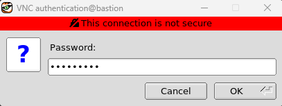
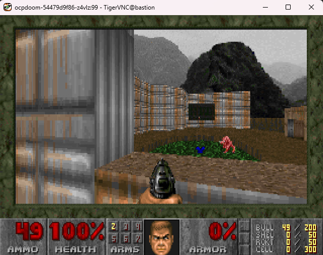

# DOOM! on OpenShift

[OpenShift Container Platform (OCP)](https://www.openshift.com) is capable of building and hosting applications. This includes video games written in C++. One of the oldest and most popular retro FPS games [DOOM](https://en.wikipedia.org/wiki/Doom_(1993_video_game)) has been containerized and brought into Kubernetes via a culmination of projects ending up in one called [kubedoom](https://github.com/storax/kubedoom). For this exercise I thought it would be interesting to build it using a [Fedora](https://getfedora.org/) based image and run it on OpenShift. We’ll call this fork [ocpdoom](https://github.com/nickschuetz/ocpdoom).

<br>

## Prerequisites

This requires you have a working instance of OpenShift 4 running before continuing. That could be any of the multitude of variants of OpenShift that are available to be utilized in just about any situation:

* [OpenShift On-prem](https://docs.openshift.com/container-platform/4.12/installing/installing_on_prem_assisted/installing-on-prem-assisted.html) (Bare Metal, Red Hat Virtualization, VMware, OpenStack)
* OpenShift on the Cloud: [AWS](https://aws.amazon.com/rosa/), [Azure](https://azure.microsoft.com/en-us/products/openshift), [Google Cloud](https://console.cloud.google.com/marketplace/browse?q=red%20hat%20openshift&pli=1), [IBM Cloud](https://www.ibm.com/cloud/openshift)
* [Microshift](https://github.com/openshift/microshift)
* <a href="https://developers.redhat.com/products/openshift-local/overview" target="_blank">OpenShift Local</a>

However, for this particular example you’ll need access to the [cluster-admin cluster role](https://docs.openshift.com/container-platform/4.12/authentication/using-rbac.html#:~:text=Cluster%20administrators%20can%20use%20the,has%20access%20to%20their%20projects.) and ability to create and utilize [NodePort](https://kubernetes.io/docs/concepts/services-networking/service/#type-nodeport). For that you will need full control of your OpenShift cluster. In addition, you will also need access to the [OpenShift Command Line Interface](https://docs.openshift.com/container-platform/4.12/cli_reference/openshift_cli/getting-started-cli.html) or “`oc`” tool.

<br>

## Building and Deploying DOOM

Once you’re logged into your OpenShift cluster using `oc` the process of building and deploying the “ocpdoom” image is made very simple.

1. Create some OpenShift Projects in which DOOM and it’s monsters will reside by running the following command from a terminal shell:

```bash
oc new-project monsters
oc new-project ocpdoom
```

2. Since the ocpdoom application will need cluster-admin privledges we will create a service account named `doomguy`, give them that cluster role:

```bash
oc create serviceaccount doomguy -n ocpdoom
oc adm policy add-cluster-role-to-user cluster-admin -z doomguy -n ocpdoom
```

3. Create the ocpdoom application and build the image from source.

```bash
oc new-app https://github.com/nickschuetz/ocpdoom.git --name=ocpdoom -n ocpdoom
oc logs bc/ocpdoom -f -n ocpdoom
```

If you'd like to see the build in progress:

The above `oc new-app` command did several things.
1. Constructed and created a Deployment based on the contents in the specified Github repo.
2. Spun up a build pod and built the ocpdoom image and then pushed it into the native OpenShift image registry
3. Finally it attempts to deploy the image once it's present. 

But it can't...

```console
NAME                       READY   STATUS             RESTARTS      AGE
ocpdoom-1-build            0/1     Completed          0             41m
ocpdoom-787969857d-265kj   0/1     CrashLoopBackOff   5 (30s ago)   4m5s
```

Assign the newly created deployment the `doomguy` service account
```bash
oc set serviceaccount deployment ocpdoom doomguy -n ocpdoom
```

Now check to see if your application pod is in a "Ready" state:

```bash
oc get pods -n ocpdoom
```

You should get an output similar to this:

```console
NAME                       READY   STATUS      RESTARTS   AGE
ocpdoom-1-build            0/1     Completed   0          44m
ocpdoom-74d97f4fbd-2h85d   1/1     Running     0          6s
```

<br>

## Monsters!

You’re going to need some monsters. Or pods represented as [Demons](https://doom.fandom.com/wiki/Demon) in this case. You’ll do this by deploying a simple little container:


```bash
oc new-app https://github.com/nickschuetz/monster.git --name=monster -n monsters
```

Oberve the build progress:
```
oc logs bc/monster -f -n monsters
```

```bash
oc get pods -n monsters
```
With an output similar to this:
```console
NAME                       READY   STATUS      RESTARTS   AGE
monster-1-build            0/1     Completed   0          11m
monster-56c7d99bdd-c874h   1/1     Running     0          4m29s
```

<br>

## Exposing DOOM

Once the image is built the Kubernetes Deployment that was automatically created via oc new-app will spin up a new pod with our newly created image. In order for us to access this pod from outside of OpenShift we’re going to use a Kubernetes service type [NodePort](https://kubernetes.io/docs/concepts/services-networking/service/#type-nodeport). To do that we can also use the OpenShift command line tool like so:

```bash
oc expose deployment/ocpdoom --port 5900 --type=NodePort
```

This image houses a VNC server to connect to the game inside the container within the pod running inside of the OpenShift Platform. In order to do so you’ll need something like the TigerVNC vncviewer found [here](https://sourceforge.net/projects/tigervnc/files/stable/).

1. To get the external IP of the node the pod resides on use the following command and record it for later:

```bash
oc get pods -l deployment=ocpdoom -o=jsonpath='{range .items[*]}{.status.hostIP}{"\n"}{end}' -n ocpdoom
```

2. To retrieve the NodePort automatically assigned to the newly created Kubernetes Service use this command and take note of it too:

```bash
oc get service -l app=ocpdoom -o=jsonpath='{range .items[*]}{.spec.ports[:1].nodePort}{"\n"}{end}' -n ocpdoom
```

3. Open up your [vncviewer](https://sourceforge.net/projects/tigervnc/files/stable/) and point it to the `<hostIP>:<nodePort>` you gathered from the two previous commands. 

<br>

Example:


Click `Connect`

4. Enter Password "openshift" and click `OK`



Congratulations! You’re now playing Doom in a container within a Kubernetes pod on the OpenShift platform accessing it all through a vnc server using vncviewer. 

It should look something like this:


<br>

## Welcome to DOOM

At this point you can run around and play the game using your keyboards arrow keys to move, ctrl (shoot) and space bar (to open doors). 

Here’s where the monster pods come in. You’ll stumble upon an open field with monsters like this roaming around. Those monsters represent the pods in your monsters namespace. If you shoot those monsters that kills them and the pod they represent.



However, there’s a problem! Since oc new-app also created a Kubernetes ReplicaSet it will respawn that missing pod monster. So really the only way to get rid of all the monster is through a non violent tactic done through the command line using the oc scale command:

```bash
oc scale deployment/ocpdoom --replicas=0 -n monsters 
```

Once all the pods are terminated all the monsters should be terminated. But watch out for the other Monsters!
